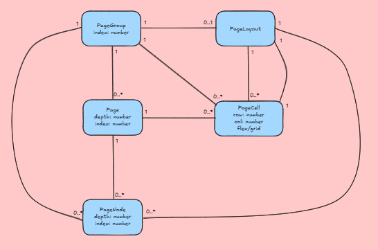
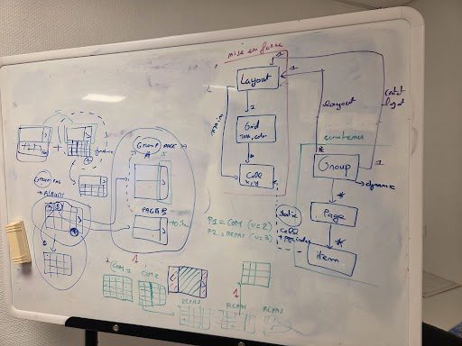
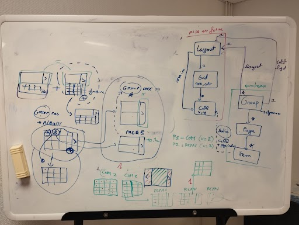
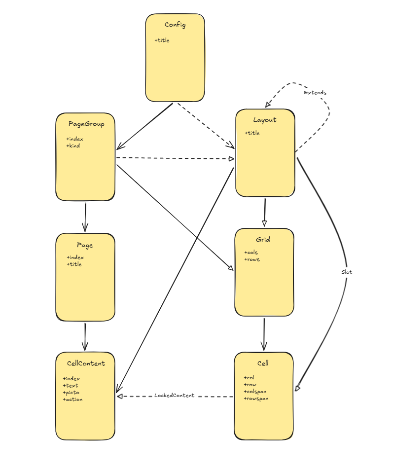

# Page architecture history

History of pages architecture discussions

## 02-09-26 Brainstorm

With Mathieu, Paul, Charlie

First formal discussions about how to navigate through pages in lifecompanion.  
We've arrived at a need for a model capable of handling this [Excalidraw diagram](https://excalidraw.com/#json=pfcrhzS34OUrfVfJtFC0M,-hQAIA15TLbVNA7Dgpl2zQ) logic.

## 02-12-26 Brainstorm

With Paul, Charlie

Brainstorm about a relational model proposition: [Excalidraw](https://excalidraw.com/#json=f2EOqBtXn-7MEHkpbPjNU,TIFh6_sB_vRy9BVCje7swA)

## 02-17-26 Brainstorm

With Mathieu, Paul, Oscar, Charlie

Previous relational model presentation and redefinitions.

## 04-22-26 IndexedDB relational implementation

Charlie 

Working on the implementation of IndexedDB in a relational style, 
I've needed to redraw the actual schema for clarity. 
This is based on the ***communiquer+.ts*** files (the config file used to build the demo).

[Excalidraw link](https://excalidraw.com/#json=Pw30Ct3bajvvoAH2NWARN,to1jSv6RFyCQXNlzyZScgQ)

