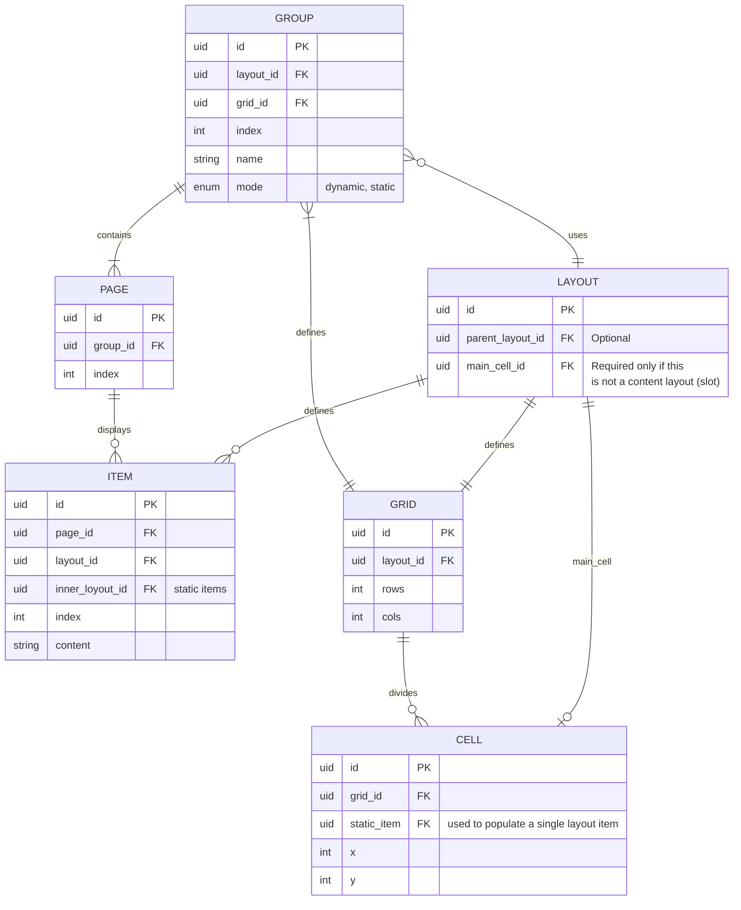

# Page Architecture

This document describes the structural organization of pages, based on [these discussions](history.md).

## Diagram

```mermaid
erDiagram
  GROUP ||--|{ PAGE : "contains"
  PAGE ||--o{ ITEM : "displays"
  GROUP }o--|| LAYOUT : "uses"
  GROUP }|--|| GRID: "defines"
  
  LAYOUT ||--|| GRID : "defines"
  LAYOUT ||--o{ ITEM : "defines"
  GRID ||--o{ CELL : "divides"
  LAYOUT ||--o| CELL : "main_cell"

  GROUP {
    uid id PK
    uid layout_id FK
    uid grid_id FK 
    int index
    string name    
    enum mode "dynamic, static"
  }

  PAGE {
    uid id PK
    uid group_id FK
    int index
  }

  ITEM {
    uid id PK
    uid page_id FK
    uid layout_id FK
    uid inner_loyout_id FK "static items"
    int index
    string content
  }

  LAYOUT {
    uid id PK
    uid parent_layout_id FK "Optional"
    uid main_cell_id FK "Required only if this
      is not a content layout (slot)"
  }

  GRID {
    uid id PK
    uid layout_id FK
    int rows
    int cols
  }

  CELL {
    uid id PK
    uid grid_id FK
    uid static_item FK "used to populate a single layout item"
    int x
    int y
  }
```
