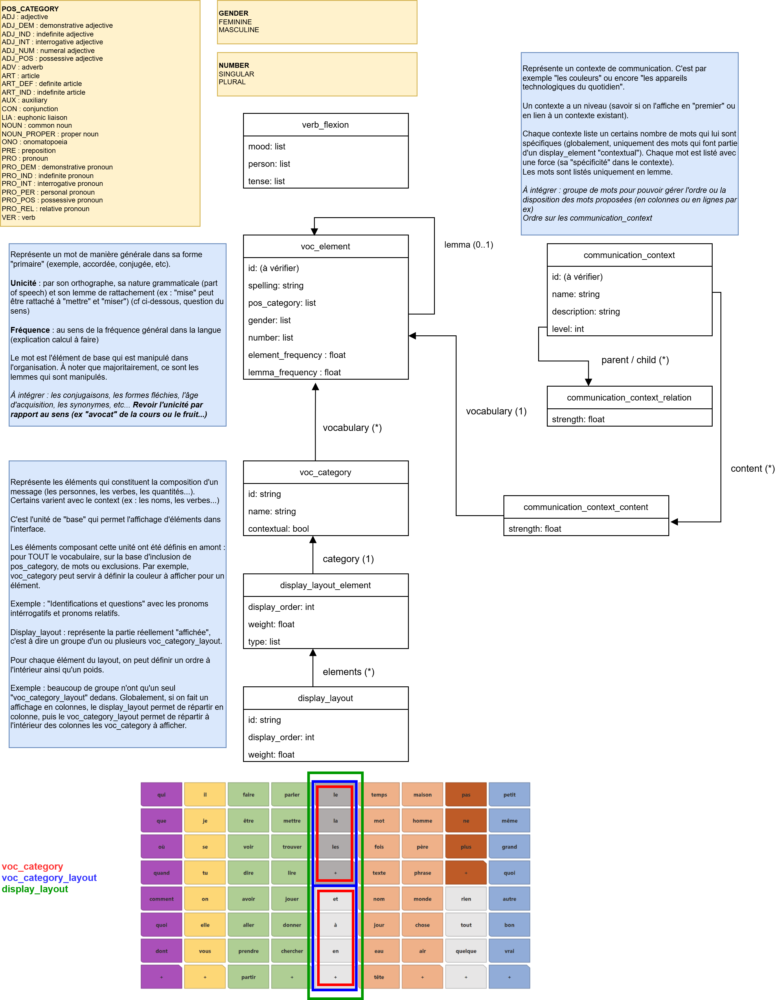
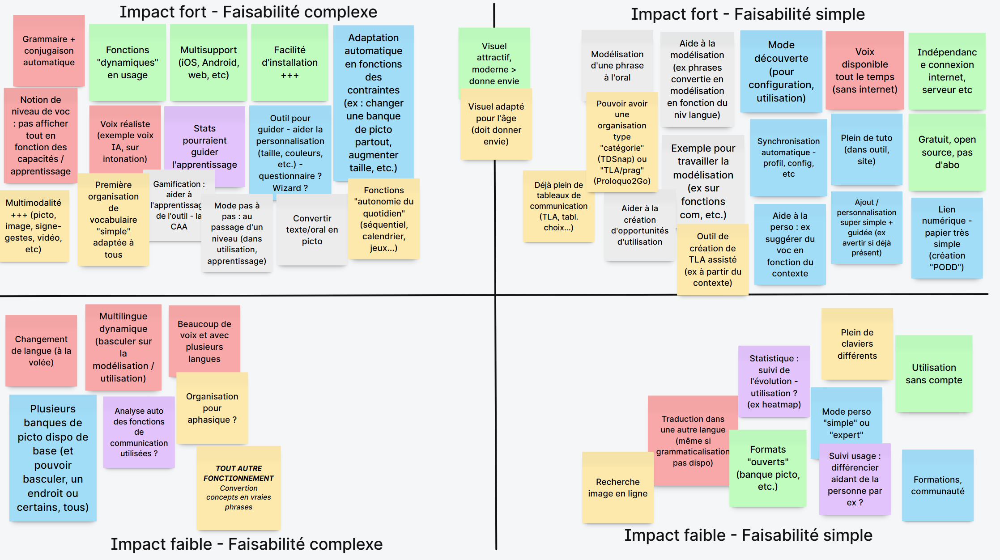
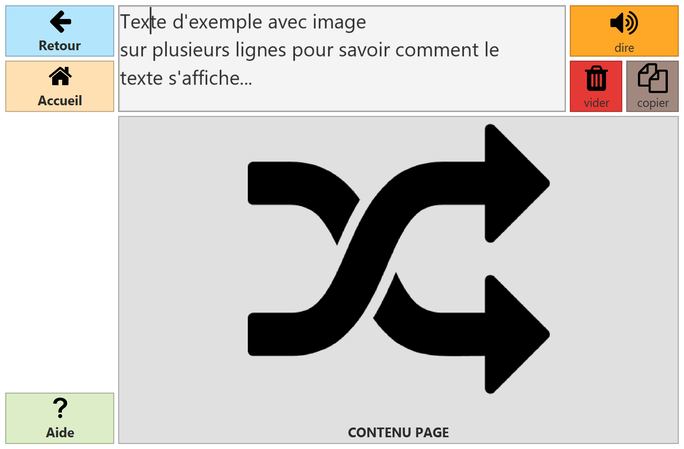
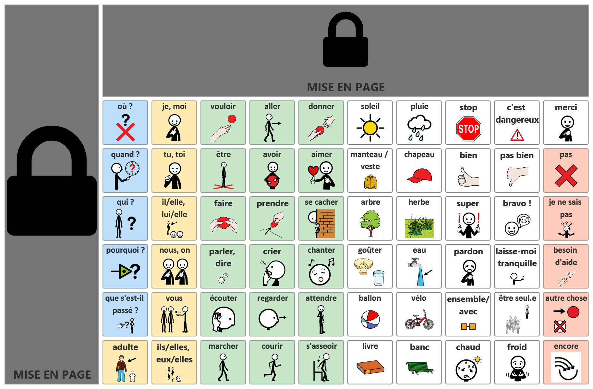
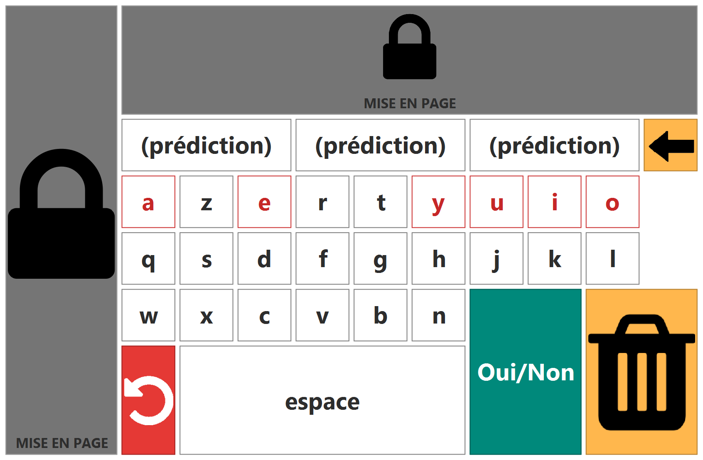
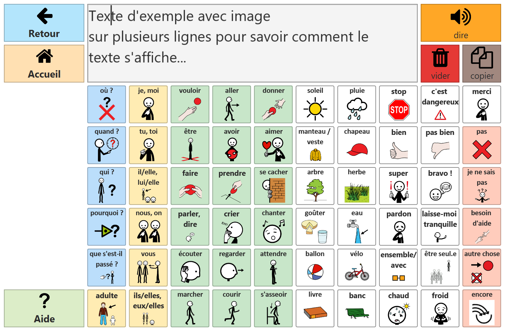

# LIFECOMPANION 2 : REFONTE 2026 !

- [Contexte et objectifs](#contexte-et-objectifs)
  - [Contexte du projet](#contexte-du-projet)
  - [Problèmes principaux du logiciel actuel](#problèmes-principaux-du-logiciel-actuel)
  - [Objectifs de la refonte (fonctionnels, techniques, UX)](#objectifs-de-la-refonte-fonctionnels-techniques-ux)
- [Périmètre](#périmètre)
  - [Fonctionnalités concernées par la refonte](#fonctionnalités-concernées-par-la-refonte)
  - [Fonctionnalités hors périmètre](#fonctionnalités-hors-périmètre)
  - [Contraintes majeures](#contraintes-majeures)
- [Besoins fonctionnels](#besoins-fonctionnels)
  - [Philosophie de la refonte](#philosophie-de-la-refonte)
  - [Liste des fonctionnalités attendues](#liste-des-fonctionnalités-attendues)
    - [Principes de fonctionnement](#principes-de-fonctionnement)
    - [Fonctionnalités clés](#fonctionnalités-clés)
    - [Fonctionnalités annexes](#fonctionnalités-annexes)
  - [Priorisation des développements](#priorisation-des-développements)
  - [Points d'attention fonctionnels](#points-dattention-fonctionnels)
  - [Fonctionnalité "organisation robuste de vocabulaire"](#fonctionnalité-organisation-robuste-de-vocabulaire)
    - [Principe du modèle](#principe-du-modèle)
    - [Fonctionnalités liées](#fonctionnalités-liées)
- [Exigences non fonctionnelles](#exigences-non-fonctionnelles)
  - [Modèle de donnée (d'une "configuration")](#modèle-de-donnée-dune-configuration)
    - [Proposition de modèle](#proposition-de-modèle)
    - [Fonctionnalités du modèle](#fonctionnalités-du-modèle)
  - [Ergonomie / UX](#ergonomie--ux)
  - [Performance](#performance)
- [Contraintes techniques](#contraintes-techniques)
  - [Environnement cible](#environnement-cible)
    - [Version de LifeCompanion](#version-de-lifecompanion)
    - [Installation et mise à jour](#installation-et-mise-à-jour)
  - [Technologies](#technologies)
  - [Interfaçages nécessaires](#interfaçages-nécessaires)
- [Organisation du projet](#organisation-du-projet)
  - [Projets liés](#projets-liés)
  - [Rôles clés](#rôles-clés)
  - [Planning](#planning)

## Contexte et objectifs

### Contexte du projet

Après 10 ans d'existence, LifeCompanion a vieilli tant d'un point de vue technique (basé sur Java et JavaFX) que fonctionnel. Dans le cadre du projet de création d'une organisation robuste de vocabulaire de LifeCompanion, le constat a été fait qu'il serait plus pertinent de profiter de cette occasion pour refondre le logiciel plutôt que de mettre à jour l'architecture technique actuelle.

Cette décision a été prise pour les raisons suivantes :
- bénéficier des 10 ans d'expérience de LifeCompanion pour restructurer une architecture plus évolutive
- moderniser l'interface de LifeCompanion pour répondre aux besoins futurs
- profiter des apports des nouvelles technologies (web, React) afin de bénéficier d'un écosystème plus dynamique (plus de librairie, moins de besoin de "faire à la main")
- uniformiser les versions "bureau" et "mobile" et bénéficier de l'expérience du développement de la version mobile
- assurer une pérénité plus importante (facilité de recrutements des compétences, technos plus attrayantes, plus de compétences dans l'équipe)

La refonte est ambitieuse mais bénéficiera de l'expérience autour de LifeCompanion (technique, fonctionelle et retours durant les usages/formations) : le développement de la version "mobile" est un bel exemple > le temps passé pour atteindre une version fonctionelle a été très réduit. Une partie des développements de la version mobile seront utilisables ainsi que les briques "système" de la version bureau.

### Problèmes principaux du logiciel actuel

- Fonctionnalités et outil orientés "technique" et non "fonctionnel" : difficile "d'embarquer" les nouveaux utilisateurs (professionnels)
- Technologie "vieillissante" et peu dynamique
- Outil ayant évolué "au fil des projets" : nouvelles briques, pas toujours une stratégie "claire" des implémentations
- Briques techniques multiples (bridges techniques, version bureau et mobile, multiples serveur)
- L'architecture n'est pas adaptée à des configurations très importantes (consomation RAM importante)

### Objectifs de la refonte (fonctionnels, techniques, UX)

- Simplifier et clarifier les fonctionnalités de l'outil : comment démarrer et pour quoi faire
- Proposer une interface moderne et bien plus simple d'utilisation pour les "petites" modifications du quotidien (90% des usages)
- Proposer une interface très simple mais conserver une profondeur fonctionelle élevée pour des usages avancés (mais masqué par une UX simple)
- Poser une base technique uniforme pour tout l'écosystème LifeCompanion
- Proposer un outil complet et directement utilisable
- Positionner plus clairement LifeCompanion : **l'outil ouvert et gratuit de CAA/accès au numérique le plus avancé !**

## Périmètre

### Fonctionnalités concernées par la refonte

L'objectif de LifeCompanion 2 est de **proposer les mêmes fonctionnalités que LifeCompanion** d'un point de vue "utilisateur final". Les fonctionnalités sont listées dans les parties ci-dessous.

### Fonctionnalités hors périmètre

Ne seront pas concernées (ou pas dans un premier temps) : 
- La rétrocompatibilité avec la version actuelle de LifeCompanion
- La fonctionnalité d'extension (mais à réfléchir dans l'architecture ?)

À l'issue de la refonte, la version actuelle de LifeCompanion sera toujours disponible (en installeur hors-ligne et dépendance API).

### Contraintes majeures

La refonte devra être effectuée entre janvier 2026 et août 2027.
On visera à livrer assez tôt des prototypes afin de pouvoir expérimenter les différentes fonctionnalités et alimenter les ateliers de coconception.

## Besoins fonctionnels

### Philosophie de la refonte

- Ne pas faire une simple transposition de l’existant.
- Pas de contrainte de rétrocompatibilité avec ancienne version
- Accepter que LifeCompanion ne fasse pas "tout"
- Limiter les "réponses aux demandes sur mesure" : poser des stratégies de modèle/UX et s'y tenir
- Priorité à l’usage réel et majoritaire des utilisateurs finaux
- Profiter de la refonte pour :
    - Questionner chaque fonctionnalité
    - Vérifier son utilité réelle
    - Simplifier son usage
- Trouver l’équilibre entre :
    - Simplicité d’utilisation
    - Puissance fonctionnelle
    - Personnalisation avancée
- Accepter que les "vrais" utilisateurs préferent parfois copier/coller qu'une logique d'abstraction : adapter l'UX/UI en conséquence

### Liste des fonctionnalités attendues

#### Principes de fonctionnement

LifeCompanion devra être composé de deux modes :
- **Mode "Utilisation"** : utilisé par les utilisateurs finaux et ne permettant que peu de modifications durant l'utilisation. C'est ce mode dont l'utilisation doit être priorisée sur toutes les plateformes.
- **Mode "Édition"** : utilisé par les "configurateurs" de LifeCompanion afin de personnaliser simplement ou finement l'outil pour les utilisateurs finaux (basée au maximum sur un fonctionnement WYSIWYG)

> Un "profil utilisateur" est appelé dans ce document "configuration" en attendant de voir si le terme sera changé. 

#### Fonctionnalités clés

LifeCompanion s'articulera autour de quatres grands usages (une même personne peut mixer les usages)
- **Communication pictographique** : utilisation d'une organisation de vocabulaire robuste combinée à une banque de pictogrammes pour faire des messages.
    - intégration de plusieurs banques de pictogrammes ouvertes (cf LifeCompanion actuel)
    - intégration d'un modèle d'organisation de vocabulaire "théorique"
    - intégration de fonctions connexes : cahier de vie, séquentiels, timers, ardoise, etc.
- **Communication orthographique** : utilisation de claviers (standards ou personnalisés) afin de rédiger des messages
    - permettant des claviers très spécifiques
    - proposant des fonctionnalités accélerant la saisie (prédictions de mots, etc.)
- **Accès au numérique** : utilisation d'interface pour remplacer clavier/souris ou simplifier l'accès à un ordinateur
    - fonctionnalités autour des simulations claviers/souris
    - barre d'outils basées sur des raccourcis claviers
    - prédictions de mots utilisables au clavier physique
- **Création de supports papiers** : utilisation de LifeCompanion pour préparer des supports à imprimer
    - Création de TLA, tableaux de communications, autre supports à base de symboles...
    - Lien facilité entre communication pictographique et cette fonctionnalité (ex : impression automatique d'un cahier de communication "à onglets" à partir de l'organisation de vocabulaire proposée)

#### Fonctionnalités annexes

- **[Modes d'interaction et de sélection](./featureDescription/selection-mode.md)**
    - Devra proposer les mêmes modalités que l'ancienne version (directe, temporisation, défilement)
    - Penser à la gestion de plusieurs modes d'interaction en parallèle (ex : direct + défilement)
    - Gestion plus fine de la "double sélection" (ex uniquement sur même case)
    - Gestion plus fine "à l'appui" ou "au relachement" (à préciser)
    - Intégration dès le début la notion de "curseur virtuel" pour gérer la sélection (facilitera l'intégration de mode d'interaction comme l'eyetracking en natif)
- **"Variables" en mode utilisation**
    - Devra toujours proposer l'intégration de "variables" dans tous les contenus textuels (texte des cases, action d'écriture/oralisation, etc.)
    - Exemple de variable : heure de la journée, jour de la semaine, texte du clipboard, etc.
- **Multi-langues**
    - Devra anticiper le côté multilangue mais pas que pour l'interface d'édition
    - Intégration dans les modèles utilisateurs : permettre la traduction de tous les éléments textuels de l'application pour permettre une bascule de langue en mode utilisation sans changement de contexte (ex : changer de langue en restant sur la même page)
    - Respecter le sens de lecture de la langue utilisé, autant dans les interfaces d'édition que dans les modèles utilisateurs. Cela pourrait également signifié que les éléments d'un modèle utilisateur seraient dans l'ordre inverse que celui configuré dans un contexte de lecture de droite à gauche.
- **Banques de pictogrammes**
    - Travailler sur une intégration au fil de l'eau des mises à jour des banques de pictogrammes
    - Banques suggérées : ARASAAC, ParlerPicto, SCLERA, Mulberry + des banques en format "SVG" d'icône
    - Voir si il peut être intéressant de le faire en mode "modulaire" ou par une API (ex : cf couleur de peau/des cheveux dans ARASAAC)
    - Voir si l'intégration en mode SVG pour pouvoir changer la couleur est possible
    - Penser à intégrer les paramètres actuels d'édition d'image de LifeCompanion
- **Événements**
    - Conserver une notion d'événement permettant de déclencher des actions "globalement" au délà de l'interraction de l'utilisateur
    - Par exemple : quand une heure arrive, quand on appui sur une touche, etc.
    - Cela ne veut pas dire qu'on ne pourra pas "abstraire" certains événements (ex : "à l'appui d'une touche déclencher les actions de la case X" peut devenir un paramètre sur une case "associer une touche clavier")

### Priorisation des développements

> Au démarrage, priorité principale donnée à **l'architecture globale de l'application** et des fonctionnalités : les différentes implémentations pourront venir ensuite si elles ont été prévues. Essayer cependant d'implémenter à minima deux choses afin de tester le modèle d'architecture.

Cela permettra de : 1) avoir la plupart des logiques déjà architecturée permettant d'avancer sur l'organisation robuste de vocabulaire 2) faciliter le partage des développements pour les implémentations

Par exemple : 
- Développer quelques paramètres de réglage d'image mais laisser de coté les autres
- Développer quelques mise en forme de barre de progression du défilement
- Développer une partie des actions d'écrire/synthèse vocale mais garder les autres pour plus tard

### Points d'attention fonctionnels

Liste ci-dessous de différents éléments à penser lors de la structuration des interfaces/modèles afin de pouvoir proposer ces futurs fonctionnements :

- **Multiple "instance" ou "fenêtre" en mode utilisation**
    - Anticiper le fait qu'on pourrait souhaiter avoir plusieurs fenêtre en parallèle durant le mode utilisation (ex pour faire des "widget")
    - Pouvoir choisir au lancement en mode utilisation plusieurs configurations > plusieurs fenêtres
- **Plusieurs configuration en édition en même temps**
    - Par exemple pour pouvoir copier/coller de l'une à l'autre ?
    - Par un système d'onglet par exemple
- ...

### Fonctionnalité "organisation robuste de vocabulaire"

#### Principe du modèle

L'enjeux de la proposition de vocabulaire robuste dans LifeCompanion va être de :
- Proposer un modèle neutre et ouvert d'organisation de vocabulaire (uniquement les donnnées)
- Proposer une interface permettant de lire et de modifier ce modèle

> L'objectif est de, contrairement à tous les outils de CAA actuels, **ne pas faire uniquement une déclinaison "modèle>interface" mais également "interface>modèle"**. Cette logique permettrait de modifier le modèle de l'organisation de vocabulaire tout en le faisant par une interface et ainsi d'avoir une bien plus grande flexibilité ! Cette logique n'est présente dans aucun outil de CAA actuel ce qui rend les "petites modifications" facile mais ne permet pas des adaptations générales des modèles.

Cette proposition de principe permettra par exemple de :
- masquer une catégorie grammaticale / un même mot partout (dans tous les contextes)
- changer la taille de grille
- mettre à jour la conjugaison d'un verbe alors que l'utilisateur a déjà personnalisé sa configuration
- choisir entre un changement global (ex réordonner les pronoms sur toutes les pages) ou spécifique à un contexte (ex ajouter un mot pour un contexte de communication)
- bascule d'un mode TLA (mixer pronoms, verbes, etc sur même page pour un contexte) à un mode catégorie (uniquement les noms communs pour un contexte)
- mettre à jour un pictogramme associé à un concept partout

Ci-dessous, un exemple de structuration : cet exemple n'est qu'un prototype et sera bien sûr à bien retravailler.

*Exemple de structuration d'un premier modèle d'organisation robuste de vocabulaire.*

#### Fonctionnalités liées

Idées issues du brainstorming outil robuste de juillet 2025.

En sont extraits les éléments fonctionnels suivants à ne pas oublier (reprise uniquement des éléments non cités dans ce document, en "liste de Noël!")
- **Autour de la structuration du vocabulaire**
    - Fonctionnalités de grammaticalisation/conjugaison automatique
    - Niveau de vocabulaire : pouvoir masquer/afficher une partie du vocabulaire en fonction des capacités de le personne
- **Autour du contenu proposé**
    - Favoriser la multimodalité : intégration pictogrammes/signes/gestes/vidéos...
    - Organisation pour aphasique
    - Fonctionnalités d'autonomie du quotidien (calendrier, jeux, séquentiel, etc.)
    - Proposition organisation "catégorie" ou "TLA"
    - Création de TLA assisté (ex : par l'IA ?)
    - Nombreux TLA déjà réalisés
    - Recherche d'image en ligne directement dans l'outil
- **Autour de l'accompagnement à l'utilisation**
    - Mode pas à pas : passage de niveau durant l'utilisation
    - Aide à la modélisation : phrases convertie en modélisation dans l'outil (à l'écrit/à l'oral)
    - Exemple suggérés pour travailler la modélisation
    - Gamification : encourage directement dans l'outil son utilisation
    - Convertir (écrit/oral) en pictogrammes
- **Autour du suivi de l'usage**
    - Statistique d'utilisation : pour évaluer et pour guider l'apprentissage
    - Pouvoir différencier usage du bénéficiaire/de l'entourage
    - Analyse des fonctions de communication utilisées
- **Autour de la voix**
    - Voix réaliste : lien avec voix IA sur intonation/expression ?
    - Voix disponible tout le temps
    - Beaucoup de voix disponible

## Exigences non fonctionnelles

### Modèle de donnée (d'une "configuration")

#### Proposition de modèle

Le modèle qui permet d'afficher des éléments dans l'interface sera simplifié par rapport au LifeCompanion actuel : **suppression de la notion de pile de grilles, grilles, sous-éléments, etc. placés de manière absolue avec des positions en pixel.**

Le modèle sera basé sur une **"zone d'édition"** : cette zone ne pourra être paramétrée que par un ratio pouvant correspondre à la cible d'utilisation (ex : 16/9 ; 19/10 ; feuille A4). Ce paramétrage permettra de garantir un mode édition plus uniforme d'un poste à l'autre. La zone d'édition représentera l'écran en entier : par exemple pour la création d'un clavier visuel, il suffira de n'utiliser qu'une partie (ex en bas au centre) afin d'avoir une fenêtre à cet emplacement en mode utilisation.

La zone d'édition sera en réalité une "grille" dans laquelle il est possible de placer des éléments similaires à LifeCompanion actuellement : des cases, des éditeurs de texte, des cases spéciales (barre progression, timer, etc.)...

La zone d'édition courant sera combinée de deux éléments : 
- **Une mise en page** : permettant de définir des éléments communs à différentes pages
- **Un contenu** : permettant de définir un contenu. Ce contenu pourra être doté d'un type afin de proposer des interfaces d'éditions adaptées (ex : organisation robuste de vocabulaire, grille statique, liste des séquences, etc.)

Une "configuration" pourra avoir autant de mise en page et de contenu que souhaité.

**Une page sera la combinaison contenu/mise en page**. L'exemple ci-dessous illustre cette logique :

*Exemple d'une mise en page*

*Exemple de contenu avec des pictogrammes*

*Exemple de contenu avec un clavier*

*Exemple d'une page basée sur contenu picto + mise en page (en mode utilisation)* 

Le contenu d'une page sera ensuite éditable en fonction du type de contenu. L'objectif est de simplifier au maximum l'édition par un utilisateur en utilisant les mêmes interfaces même si le modèle "backoffice" n'est pas le même. Par exemple, l'édition du contenu d'une page statique reviendra à modifier des cases à des positions spécifiques, alors que l'édition du contenu d'une page "orga robuste" reviendra à modifier le modèle de l'organisation de vocabulaire.

Un soin particulier sera apporté à l'interface pour fluidifier au maximum les modifications et rendre compréhensible cette logique et ce modèle (cf partie UX).

L'interaction continuera de se baser sur le même principe que la version actuelle de LifeCompanion : l'utilisateur sélectionne des cases qui peuvent avoir des actions associées (à sans doute challenger/adapter durant les développements.)

#### Fonctionnalités du modèle

- pouvoir être partagé d'une instance à l'autre (ex entre deux version "bureau", entre version "bureau" vers "mobile", etc.)
    - par du transfert de fichier
    - par une synchronisation Cloud LifeCompanion
    - par une synchronisation Cloud externe (Drive, Dropbox...)
- être conçu pour favoriser la mise à jour des modèles proposés
    - cas typique : un utilisateur part d'un modèle complet et fait quelques modifications dans celui-ci ; on veut alors qu'une mise à jour du modèle dont il est parti lui bénéficie
    - piste de solution : un "hash" des éléments pour mettre à jour les éléments qui n'ont pas été personnalisés ?
- favoriser une utilisation en chargement dynamique (faire en sorte qu'il n'y ait que le nécessaire chargé pour une page donnée, même en mode édition, cf Performances)

### Ergonomie / UX

L'ergonomie est l'un des point clé de la refonte !

On visera à **simplifier et à minimiser les différentes interfaces pour faire la même** : actuellement dans LifeCompanion, la modification d'une case peut se faire à 4 endroits différement selon son type (ex : liste de case, basique, séquence...).

Dans l'édition des "mises en page / contenu" : on pourra par exemple griser certaines zone en transparence pour bien indiquer si on modifie la mise en page ou le contenu tout en laissant la possibilité de cliquer sur un élément grisé afin de basculer dans ce mode d'édition. L'objectif est de limiter les messages type "Attention vous allez modifier partout" et que cela respecte la majorité des attentes naturelles des personnes (quitte à interpréter certains comportements dans l'UI).

**Pour la "mise en route" de LifeCompanion on visera à guider**
- sur le choix d'une configuration de démarrage (ou de plusieurs)
- sur les premières modifications à effectuer dedans
- sur la logique globale de l'application

Quelques éléments à penser autour de l'UX/UI :
- **Vocabulaire et nommage**
    - choisir des termes compréhensibles et cohérents (ex "page" plutôt que "grille" si plus parlant).
    - chaque fonctionnalité doit être nommée en fonction de son usage réel, pas de son implémentation technique (ex "page d'accueil" plutôt que "grille de démarrage")
    - harmoniser le vocabulaire dans toute l’application.
- **Sélection multiple**
    - on favorisera la possibilité de faire des modifications uniformément sur tous les éléments sélectionnés
    - on implémentera cette logique pour tout : le texte, la mise en forme, des paramètres avancés, etc...
- **Utilisation sur tablette tactile**
    - il faut penser que de nombreuses personnes pourront vouloir personnaliser directement depuis le dispositif de l'utilisateur (tablette tactile)
    - il conviendra alors d'adapter les interactions afin d'être compatible avec le tactile (ex : drag n drop vs scroll, clic droit, etc)

### Performance

Modèle "chargement dynamique" à privilégier pour tout (page, images, etc) : le but est de minimiser au maximum l'utilisation de la RAM et de favoriser des éléments stockés sur le disque.

L'utilisation d'une SQL Lite peut être envisagée (déjà testé sur prototype d'organisation de vocabulaire robuste de CAA).

## Contraintes techniques

### Environnement cible

#### Version de LifeCompanion

On différenciera à minima deux versions de LifeCompanion :
- **Version "Bureau"** : logiciel utilisable sur Windows (incluant ARM64), Linux et MacOS proposant les deux modes. L'implémentation de référence doit être sous Windows.
- **Version "Mobile"** : application utilisable sur Android (à minima), iOS (plus tard) et proposant au moins le mode "Utilisation". L'implémentation de référence doit être sous Android.

> Préciser ici les versions minimales cibles pour chacun des systèmes.

Les contraintes de fonctionnement dans l'environnement cible sont :
- Fonctionnement totalement hors-ligne pour la totalité des fonctionnalités clés
- Fonctionnement en ligne acceptable pour des fonctions annexes (ex : traduction automatique avancée, utilisation IA avancée, etc.)

#### Installation et mise à jour

**Concernant l'installation :**
- On visera une installation la plus simple possible
- On veillera à utiliser les store d'application pour les dispositifs mobiles (à voir pour version bureau)
- On pourra proposer une version "offline" ou "online" de l'installeur (dépendance ou non à internet)
- On pourra proposer une version avec éditeur (par defaut) ou une version sans éditeur plus légère
- On pourra proposer une installation avec/sans droits d'administrateurs (simplification installation dans structures de santé)
- On séparera clairement les fichiers "statiques" des fichiers "utilisateurs" dans le but de s'intégrer dans la plupart des environnements (exemple : sur serveur RDS)
- On pourrait également proposer une version "offline" sans installeur (un fichier executable qui lance LifeCompanion immédiatement sans l'installer sur le système)

**Concernant la mise à jour :**
- Elle devra être la plus transparente possible (ex : actuellement, téléchargement en fond de la dernière version et remplacement au prochain lancement)
- Elle devra être peu contraignante (assurance rétro/post compatibilité)
- Elle devra être centralisée dans la mesure du possible (limiter les serveurs/API)

En complément, on veillera à permettre à LifeCompanion une intégration totale dans le système notament par (quand cela est possible) : 
- Lancement automatique avec le système directement en mode utilisation
- Verouillage de la fermeture/plein écran pour utiliser uniquement LifeCompanion
- Intégration dans les logiques systèmes (raccourcis, présence menus, association fichier, etc.)

### Technologies

Organisation du code sous forme de mono repo devant tout contenir, excepté le serveur de service externes (plateforme lifecompanionaac.org).

Choix à faire entre :
- Plateforme hybride
    - Core : React
    - Desktop : Electron avec rendu HTML
    - Mobile : React Native
- Plateforme "full HTML"
    - Core : React
    - Desktop + Mobile : Tauri

### Interfaçages nécessaires

LifeCompanion dépend actuellement des interfaces systèmes suivantes (sur Windows) :
- Hook pour recevoir les entrées clavier sur tout le système (permet mise à jour prédiction quand utilisation "partout")
- Lib pour envoyer des entrées clavier / souris (clavier/souris virtuels)
- Lib pour utiliser la synthèse SAPI sous Windows

En parallèle, afin de conserver les fonctionnalités d'accès au numérique de LifeCompanion, on sera vigilant à permettre
- Un gestion fine des fenêtre (non focusable, toujours au dessus, taille, position, transparence, plein écran...)
- Un lien avec le système (pour le lancement de programmes, l'accès au clipboard, lancement URL, ouverture dossiers...)
- Un lien avec le système de fichers pour importer/exporter

## Organisation du projet

### Projets liés

Les deux projets en lien avec cette refonte :
- **Open Core Vocabulary** : financé Fonds de Dotation Kerpape et cofinanceurs (Makaton, GNCHR), ciblé sur la création d'une organisation robuste de vocabulaire
- **Prestation version mobile projet HIT** : financé Hoppen, ciblé sur la création d'une version Android

### Rôles clés

- Mathieu : conception fonctionelle globale et données (modèles, configurations, banques picto, organisation vocabulaire)
- Paul : architecture applicative, logique installation/mise à jour, conception modèle abstraction
- Charlie : organisation robuste de vocabulaire, interface d'édition bureau
- Oscar : version mobile et interface utilisation bureau

### Planning

Rétroplanning grossier à faire
